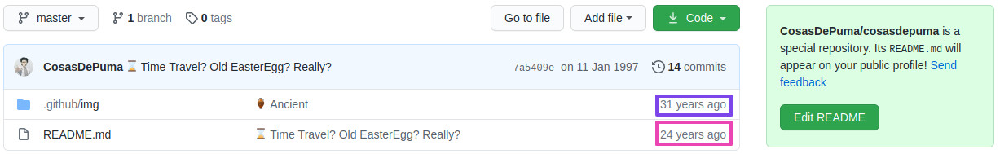

<!-- Header -->
<h1 align="center">Hi 👋, I'm <a href="https://linkedin.com/in/kikefontan">Kike Fontán</a></h1>
<h3 align="center">A passionate cybersecurity researcher from Spain with some nice skills</h3>

<!-- Skills -->

	
    
	
	
	
	
	
	
	
	
        
    

<!-- Badges -->

	
	
	

<!-- Time Travel -->
<h2 align="center">Did I found an Ancient Easter Egg?</h2>

    

<!-- Dinosaur -->

    

